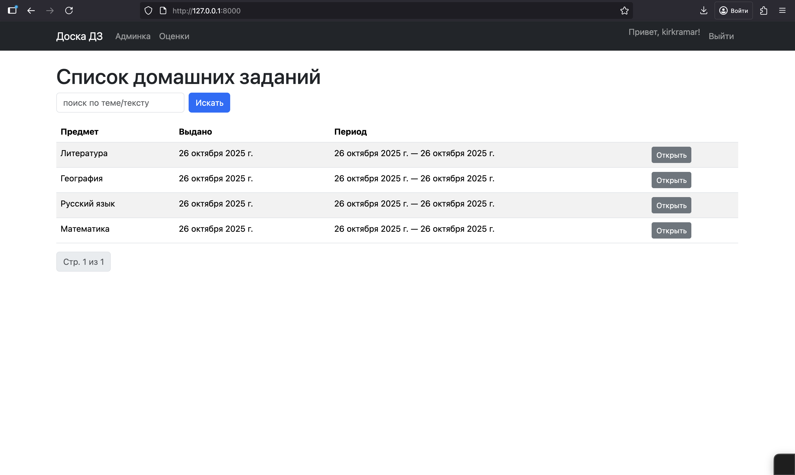
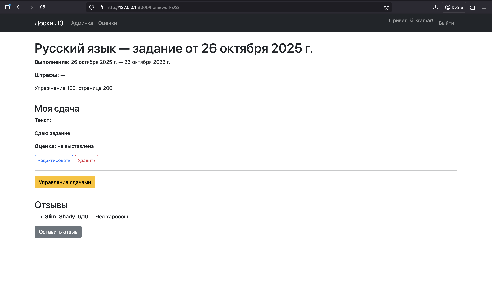
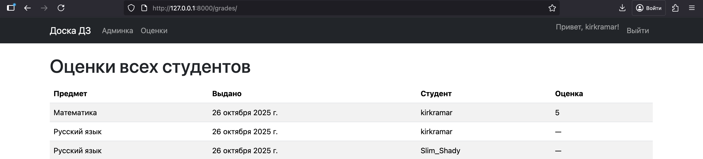

# Интерфейс и роли

## Роли
- **Студент (обычный пользователь)**:
  - Видит список и детали ДЗ.
  - Может создать/редактировать/удалять **только свою** сдачу.
  - Может оставлять отзыв к ДЗ.
- **Преподаватель (`is_staff`)**:
  - Всё как студент.
  - Плюс видит в деталях ДЗ кнопку **«Управление сдачами»** и может выставлять/менять оценки.
  - Имеет доступ к **/admin/** для полного CRUD.

## Скриншоты

### Список ДЗ с поиском и пагинацией

### Детали ДЗ и «моя сдача»

### Таблица оценок

